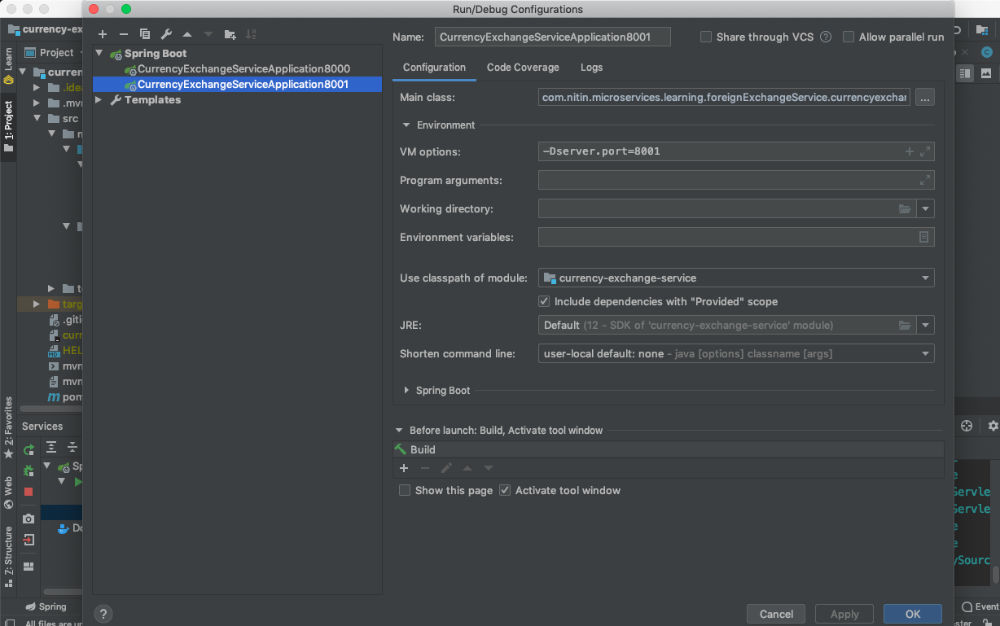

# currency-exchange

Running multiple instances

Goto Run -> Edit Configurations and duplicate the spring boot profile



Set the VM Options as follows 
```shell script
-Dserver.port=8001
```

This will override the server.port value set in the application.properties file


Run the two instances together